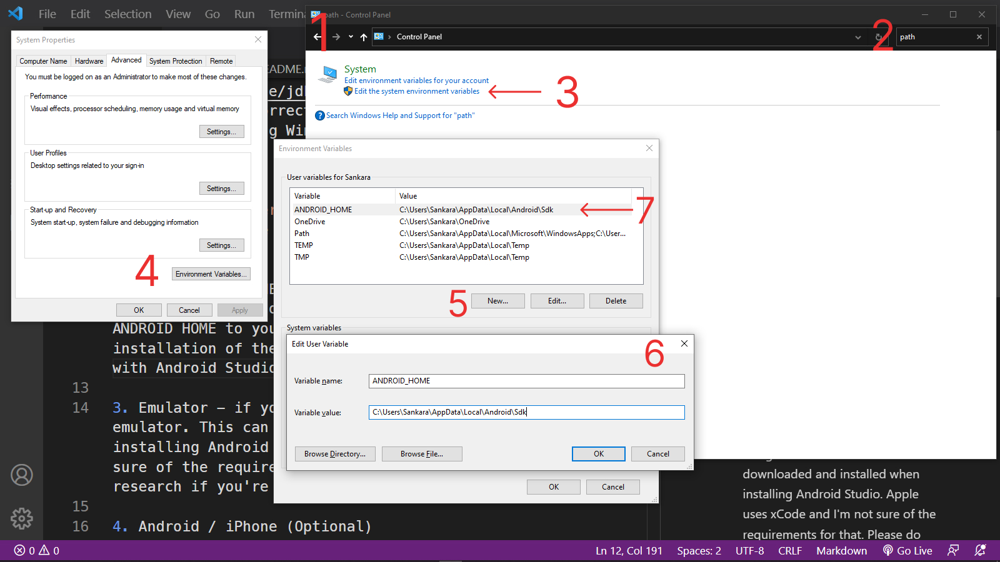

# REQUIREMENTS / TODO

1. Java + Java Compiler (Preferred Java 8 or Java 11) - other versions don't work according to what I've tested and researched.

- Install Java 11 from [Oracle](https://www.oracle.com/java/technologies/javase/jdk11-archive-downloads.html). Make sure to get the correct version for your operating System. I'm running Windows 10.

2. Android Studio

- Install it from [here](https://developer.android.com/studio). Make sure to get the correct version for your operating system.
- Apple uses xCode and I'm not sure of the requirements for that. Please do some more research if you're using MacOS.

3. Add ANDROID_HOME variable to your PATH.

- On Windows, go to your environment variables and add ANDROID HOME to your path, pointing to your installation of the Android SDK. This comes together with Android Studio. See image below - the numbers correspond to the numbers on the image:
  

  1. Open up Control panel
  2. Search for "path"
  3. Click on "Edit the system environment variables"
  4. On the window that pops up, click on "Environment Variables"
  5. Click on "New" which is going to open window number 6.
  6. Add "ANDROID_HOME" as Variable Name, and the path to your Android SDK installation as the Variable value and click on "OK"
  7. You should see your new variable added to your system path.

#

## **If you're running Fedora 36**

- For Fedora 36, use [this link](https://www.itzgeek.com/how-tos/linux/fedora-how-tos/install-android-studio-on-fedora.html) to install Android Studio. To add it to your PATH, navigate to your `~/.bashrc` file and add in these lines:

```
export ANDROID_HOME=$HOME/Android/Sdk
export PATH=$PATH:$ANDROID_HOME/tools
```

To verify whether it worked, open your terminal and type in `echo $ANDROID_HOME`. If you had any terminal open, close all of them and restart it for the changes to apply.

More information on [this link](https://stackoverflow.com/questions/26256279/how-to-set-android-home-path-in-ubuntu#:~:text=For%20command%2Dline%20tools%2C%20use,Then%20try%20compiling.)

### **End of Fedora Stuff**

#

3. Emulator - optional if you're going to build using an emulator. This can be downloaded and installed when installing Android Studio. Once again, Apple uses xCode and I'm not sure of the requirements for that. Please do some more research if you're using MacOS.

4. Android / iPhone (Optional)

- In case you don't want to use an Emulator, you can connect your mobile device to your computer using a USB cable, and enable USB debugging on your phone - (follow [this link](https://www.embarcadero.com/starthere/xe5/mobdevsetup/android/en/enabling_usb_debugging_on_an_android_device.html) to learn how to enable USB debugging on Android) - to use your physical device as an emulator.

5. Expo GO (Optional)

- You can also optionally use Expo GO to view your app on your mobile device when building. You don't have to connect it to your computer - only thing is that you have to be using Expo in your React Native App.

#

Compiled By [Thomas Sankara](https://youtube.com/@tsbsankara)
[Donate](https://streamlabs.com/tsbsankara1/tip) to support the channel: https://streamlabs.com/tsbsankara1/tip
